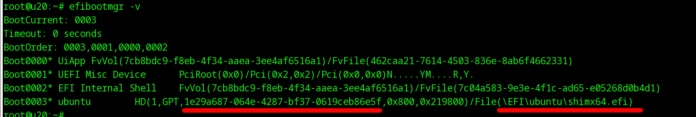
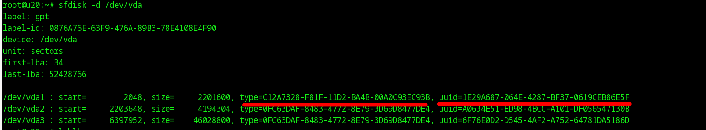
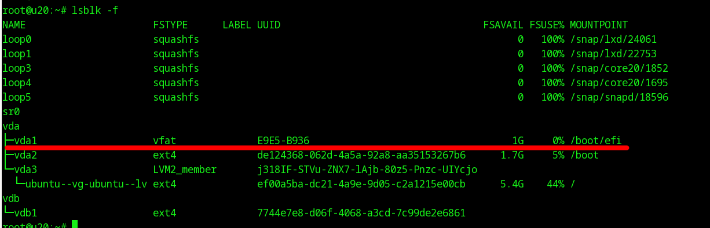
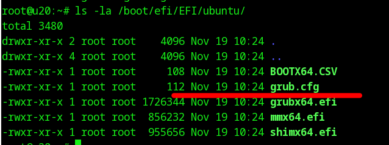
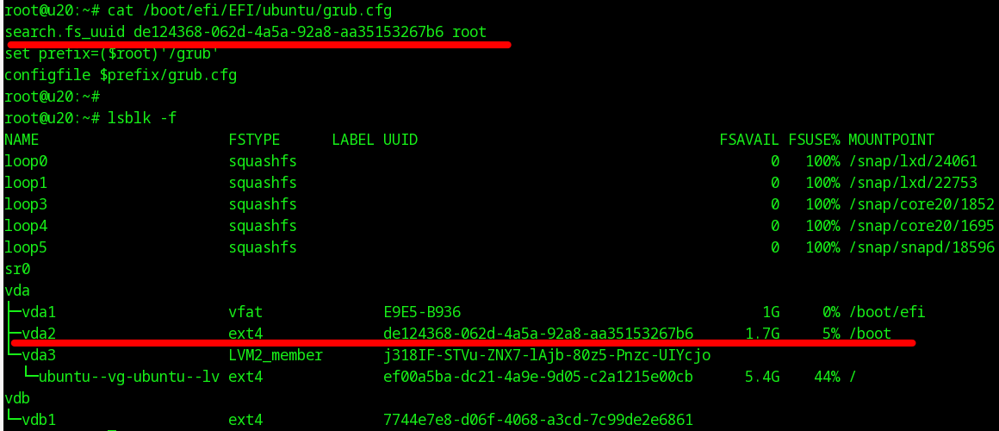

Полезная статья - https://tech-geek.ru/computer-boot-process/

### Как можно отследить все компоненты загрузки по UEFI

Проверить, что машина использует UEFI, можно так: `ls /sys/firmware/efi` - если такой путь есть, то мы загружены с использованием EFI.

Записи о порядке загрузки живут в NVRAM компьютера и не имеют отношения к дискам компьютера (виртуальной машины).
Посмотреть их можно с помощью утилиты `efibootmgr -v`

Красным подчеркнуты, во-первых, GUID партиции, на которой живет UEFI first-stage bootloader (их много разных, часто встречается grub и shim), во-вторых, путь к загрузчику внутри этой партиции. Фактически эта строка говорит, что в случае указанной опции загрузки мы будем загружаться с HD номер 1 (по шине?), UUID партиции такой то, путь к загрузчику такой то.

Опций загрузки может быть несколько, каждая про свое, ну и есть порядок загрузки. Рассмотрим одну из загрузочных записей.

Понять, что это за партиция, очень просто:

UUID из вывода `efibootmgr -v` указывает на UUID GPT партиции на нашем диске. Тип у нее **всегда** будет такой (*C12A7328-F81F-11D2-BA4B-00A0C93EC93B*).

Понимаем, что это /dev/vda1 - там живет UEFI first-stage bootloader.

Смотрим, куда он примонтирован:

Идем туда и смотрим, что там есть:

Там всегда есть наш загрузчик и grub.cfg - загрузчик, похоже, ищет его рядом с собой.

Содержимое grub.cfg будет отличаться в зависимости от используемого загрузчика. В частности, в случае использования **shim** там будет конфиг, где указано, где искать другой конфиг GRUB.

Здесь написано, что в качестве root (/) для UEFI first-stage bootloader мы используем раздел /dev/vda2, который на самом деле /boot. Там живет конфиг grub.cfg, который, если посмотреть внутрь, ссылается на vmlinuz и initrd в своих menuentry, которые должны быть доступны в этом самом root (/) загрузчика (в корне или во вложенных каталогах).

### Процесс загрузки

При загрузке UEFI bios обнаружит default boot option согласно `efibootmgr -v`, пойдет по указанному для нее пути до загрузчика (EFI\\ubuntu\\shimx64.efi) и запустит его. 

Этот загрузчик - это микро-ОС со встроенными модулями (ядра). 

Этот загрузчик читает лежащий рядом с ним `grub.efi`. Этот grub.efi может как сам содержать нужную для загрузки информацию (так это происходит в centos), так и ссылаться на другой конфиг grub в другом месте. Важно то, что написано **в конечном конфиге grub**.

Конечный конфиг grub должен соответствовать возможностям (читай - модулям ядра) загрузчика. Если при загрузке Вы видите ошибку про невозможность insmod - значит в конфиге написано то, что загрузчик сделать не может.
